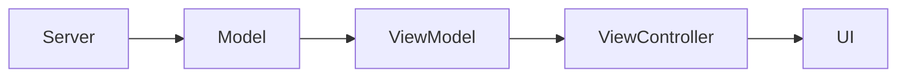

# MVVM Architecture

VennWL-iOS uses the Model-View-ViewModel (MVVM) pattern to separate concerns and improve testability.

## Components
- **Model:** Represents data from the server (e.g., products, modules).
- **ViewModel:** Transforms models into data for the UI, handles business logic.
- **ViewController:** Renders the UI, binds to the ViewModel, and handles user interaction.

## Data Flow



## Example
```swift
// Model
struct Product: Codable {
    let id: String
    let name: String
}

// ViewModel
class ProductViewModel {
    let product: Product
    var displayName: String { product.name.uppercased() }
    init(product: Product) { self.product = product }
}

// ViewController
class ProductViewController: UIViewController {
    var viewModel: ProductViewModel!
    // ... bind viewModel.displayName to a label
}
```

## Benefits
- **Testability:** ViewModels can be unit tested without UI.
- **Maintainability:** Clear separation of concerns.
- **Scalability:** Easy to add new features or refactor. 