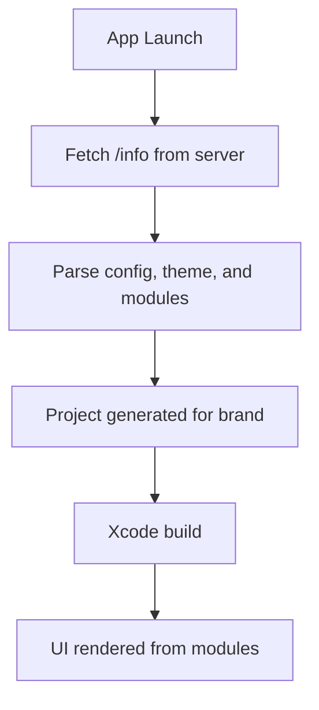

# Architecture Overview

VennWL-iOS is architected for scalability, modularity, and rapid white-label deployment. The codebase is organized to maximize code reuse while allowing deep customization for each brand.

## High-Level Structure

- **MVVM Pattern:** Models, ViewModels, and ViewControllers are clearly separated for testability and maintainability.
- **Modular Components:** UI is built from reusable modules, defined in Swift and configured by server-driven JSON.
- **White-label Support:** Brand-specific resources and configs are injected at build time.

## Key Directories

| Directory         | Purpose                                      |
|-------------------|----------------------------------------------|
| `Sources/`        | Core app logic, models, services, UI         |
| `Target Resources/` | Brand-specific assets and entitlements      |
| `TuistConfig/`    | Per-brand build settings (.xcconfig)         |
| `fastlane/`       | Automation scripts for build/deploy          |
| `Resources/`      | Shared assets, storyboards, localization     |

## App Flow Diagram

## Example: Launch to Home Screen
1. App launches and fetches `/info`.
2. Parses the homepage layout (list of modules).
3. Generates the project for the selected brand.
4. Renders the homepage using `ModularHomeViewController` and the decoded modules.

> **See also:** [Server-driven UI](../core/server-driven-ui), [Modular Component System](../core/modular-component-system) 