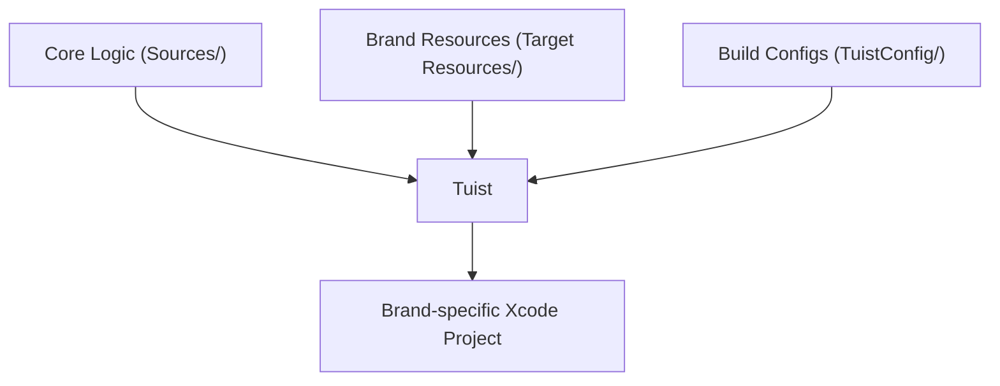

# White-label System

VennWL-iOS is designed as a white-label platform, enabling multiple branded apps to be built from a single codebase. This approach maximizes code reuse and simplifies maintenance across many clients.

## How It Works

- **Core Logic:** Shared across all brands in the `Sources/` directory.
- **Brand-specific Resources:** Each brand has its own assets and entitlements in `Target Resources/<BrandName>/`.
- **Build Configs:** Per-brand `.xcconfig` files in `TuistConfig/` define build settings, bundle IDs, and more.
- **Project Generation:** [Tuist](https://tuist.io/) assembles the correct combination of code, resources, and configs for each brand.

## Build Flow

1. Add brand resources and configs.
2. Run Tuist to generate the Xcode project for the desired brand.
3. Build and deploy as a standalone app for that brand.

> **Tip:** See [Adding a New Brand](../getting-started/adding-a-brand) for a step-by-step guide. 