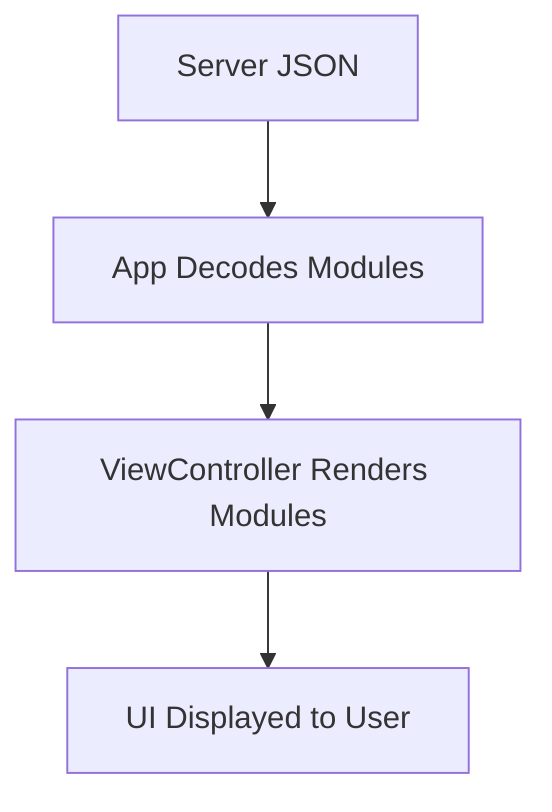

# Dynamic Modules Overview

Dynamic modules are the building blocks of the VennWL-iOS UI. Each module is a reusable component (e.g., text box, gallery, product grid) that can be configured and arranged by the server.

## How Modules Work
- The server sends a JSON layout describing which modules to render and their configuration.
- Each module is decoded into a `VLayoutItem` with a `moduleType` and `attributes`.
- View controllers (e.g., `ModularHomeViewController`) render the modules in a collection view.

## Example JSON
```json
{
  "moduleType": "VTextBox",
  "attributes": {
    "bodyText": "Welcome to our store!",
    "fontColor": "#000000"
  }
}
```

## Module Rendering Flow


> **See also:** [Supported Modules](supported-modules) 